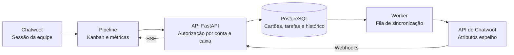

<p align="center">
  
</p>

<p align="center">
  <strong>Transforme o atendimento em um fluxo de trabalho visível.</strong><br>
  Funis, tarefas e métricas dentro do Chatwoot, com a sessão da sua equipe.
</p>

<p align="center">
  <a href="docs/plano-0.2.0.md"></a>
  <a href="docs/fase-1-autorizacao.md"></a>
  
  <a href="LICENSE"></a>
</p>

<p align="center">
  <a href="#o-que-você-pode-fazer">Funcionalidades</a> ·
  <a href="#por-dentro-do-pipeline">Prévia</a> ·
  <a href="#instalar-em-um-chatwoot-existente">Instalação</a> ·
  <a href="docs/README.md">Documentação</a> ·
  <a href="CONTRIBUTING.md">Contribuir</a>
</p>

---

## O que você pode fazer

Organize negociações em **Pipeline → Kanban** e acompanhe os resultados em
**Pipeline → Métricas**, no menu lateral do Chatwoot. A interface acompanha o tema
claro ou escuro e mantém o contexto da conta selecionada.

| | Recurso | No dia a dia |
| :---: | --- | --- |
| 🗂️ | **Múltiplos funis** | Organize etapas, arraste cartões e acompanhe o valor de cada negociação. |
| ✅ | **Tarefas compartilhadas** | Crie, edite e conclua a tarefa do contato, com vencimento e indicação de atraso. |
| 💬 | **Conversa vinculada** | Siga a conversa de atividade mais recente ou fixe outra no cartão. |
| 📊 | **Métricas e CSV** | Compare períodos e analise ganhos, perdas, origens, equipe e atendimento. |
| 🕓 | **Histórico** | Consulte movimentos e ações, com filtros por contato, funil, etapa e autor. |
| 🔐 | **Acesso por caixa** | Cada agente acessa os cartões permitidos pela sua sessão no Chatwoot. |

Um contato pode ter várias negociações no mesmo funil e em funis diferentes. A tarefa ativa é compartilhada por
contato e conta. Negociações são criadas manualmente; a importação de contatos é
uma ação separada da ativação.

## Por dentro do Pipeline

<p align="center">
  
  <br>
  <sub>Captura do ambiente de desenvolvimento. A apresentação visual não representa certificação de produção.</sub>
</p>

<details>
<summary><strong>☀️ Ver o painel no tema claro</strong></summary>

<p align="center">
  
</p>

</details>

**Ganhos e receita · Conversão · Tempo na etapa · Motivos de perda · Tarefas · Atendimento**

Os relatórios usam datas civis de Brasília e valores em reais. Cada bloco pode ser
exportado em CSV. Consulte o [guia de métricas](docs/metricas.md) para conhecer as
fórmulas, os filtros e os limites de cada indicador.

## Como funciona



O loader registrado em `DASHBOARD_SCRIPTS` incorpora a interface ao Chatwoot,
preservando seu código-fonte. Cartões e tarefas têm autoridade local; o worker
sincroniza os atributos espelho e tenta novamente quando há falhas temporárias.
Alterações concorrentes retornam conflito para evitar sobrescritas silenciosas.

| Camada | Tecnologia |
| --- | --- |
| API e worker | Python 3.12 · FastAPI · httpx |
| Persistência | PostgreSQL 16 · asyncpg · Alembic |
| Interface | HTML · CSS · JavaScript · Chart.js |
| Atualizações | SSE com listener PostgreSQL compartilhado por processo |
| Integração local | Nginx · Rails/Sidekiq do Chatwoot |

## Permissões que acompanham a equipe

- **Administradores:** acesso aos cartões da conta e às configurações administrativas.
- **Agentes:** cartões cuja conversa vinculada pertence a uma caixa permitida.
- **Sem conversa:** cartão visível ao administrador e ao criador, sem canal ou atalho.
- **Contatos e tarefas:** seguem a visibilidade de contatos do Chatwoot Community Edition.
- **Conta desativada:** bloqueia dados, webhooks e novas unidades de trabalho do worker.

As caixas são consultadas com a sessão do agente, com **cache de até 60 segundos**.
Falha ou timeout na consulta nega acesso. Histórico de cartões, métricas, CSV e SSE
respeitam o mesmo escopo. [Detalhes da autorização →](docs/fase-1-autorizacao.md)

## Instalar em um Chatwoot existente

O instalador já pode ser usado por pessoas com acesso ao repositório e à imagem.
**A release 0.2.0 ainda está em preparação.** Os ensaios completos dos adaptadores
cobrem **Chatwoot CE 4.18.0, ARM64**, com os limites abaixo. Consulte a
[matriz de compatibilidade](docs/compatibilidade-0.2.0.md) antes de instalar.

| Sua instalação atual | Adaptador | Requisitos específicos |
| --- | --- | --- |
| Docker Swarm + Traefik 3 | `swarm` | Manager de nó único; Rails/PostgreSQL locais; redes overlay existentes; origem e entrypoint já configurados no Traefik |
| Docker Compose + Nginx | `compose` | Daemon local; plugin Compose; redes bridge existentes; gateway Nginx próprio em porta livre; HTTP local |

Execute no host Docker com acesso administrativo, Git e Python 3.12. O Chatwoot
precisa estar funcionando, com Rails runner disponível e PostgreSQL 16 permitindo
`pg_dump` pelo usuário configurado no container. Reserve espaço para backups e RAM
para os dumps, que são cifrados antes de gravar. Não execute uma atualização do
Chatwoot ao mesmo tempo. O instalador cria um banco Kanban separado, aplica as
migrações e provisiona as contas selecionadas; não precisa criar `.env` nem executar
Alembic manualmente para este caminho.

### 1. Baixar o instalador

O repositório é privado: solicite acesso ao mantenedor e autentique o Git antes de
clonar. Acesso ao código e acesso à imagem GHCR precisam estar liberados.

```sh
git clone --branch master https://github.com/vitorpaimio/chatwoot-kanban.git
cd chatwoot-kanban
python3.12 -m venv .venv
.venv/bin/pip install -r requirements.txt
.venv/bin/python -m installer --help
mkdir -p .local
chmod 700 .local
```

### 2. Obter a imagem do commit aprovado

Abra [Actions → Validar e publicar](https://github.com/vitorpaimio/chatwoot-kanban/actions/workflows/test.yml)
e escolha uma execução **concluída com sucesso** da branch `master`. No resumo do
job de publicação, copie o commit testado e a referência
`ghcr.io/vitorpaimio/chatwoot-kanban@sha256:...`. Ela também está em
`image-digest.txt`, no artefato `image-digest-<commit>`. Se a publicação ainda não
terminou ou falhou, aguarde uma execução aprovada; não use o digest de zeros dos
exemplos.

Use o instalador do mesmo commit da imagem:

```sh
git checkout SHA_DO_COMMIT_APROVADO
.venv/bin/pip install -r requirements.txt
# Para imagem privada: informe seu usuário; cole o token apenas no prompt de senha.
# O token GitHub precisa de read:packages e acesso ao pacote.
docker login ghcr.io
# Substitua pelo contexto e pela referência completos obtidos acima.
docker --context default pull ghcr.io/vitorpaimio/chatwoot-kanban@sha256:DIGEST_REAL
```

O pull deve passar no mesmo contexto usado pelo instalador, inclusive no Swarm
de nó único. Não coloque token no JSON, no comando ou em arquivos do repositório.

### 3. Configurar o ambiente escolhido

Copie **um** exemplo:

```sh
# Swarm/Traefik:
cp deploy/installer.example.json .local/instalacao.json
# OU Compose/Nginx:
# cp deploy/installer.compose.example.json .local/instalacao.json
```

Edite `.local/instalacao.json`. Todos os nomes e digests dos exemplos precisam
corresponder ao seu ambiente:

| Campo | Como preencher |
| --- | --- |
| `name` | Nome exclusivo para a instalação Kanban; no Compose, diferente do projeto Chatwoot |
| `context` | Contexto mostrado por `docker context ls`, normalmente `default` |
| `accounts` | IDs numéricos das contas que receberão Kanban; aparecem em `/app/accounts/ID` na URL do Chatwoot |
| `image` | Referência completa por digest copiada da CI e baixada no passo 2 |
| `public_url` | Origem usada pela equipe para abrir o Chatwoot, sem caminho, por exemplo `https://chat.example.com` |
| `chatwoot_url` | Endereço interno do Rails acessível pela rede Docker, por exemplo `http://rails:3000` |
| `chatwoot_service` / `chatwoot_database_service` | No Swarm, nomes completos de `docker service ls`; no Compose, chaves dos serviços, como `rails` e `postgres` |
| `chatwoot_database` / `chatwoot_database_user` | Nome do banco e usuário existentes no container PostgreSQL do Chatwoot |
| `chatwoot_network` | Rede existente que permite acessar o Rails; confira com `docker network ls` |
| `network` | Rede existente do Traefik no Swarm; rede bridge compartilhada no Compose |

**Swarm:** confirme `entrypoint` e `tls` conforme o Traefik existente. Se Rails
precisa de um wrapper para carregar segredos, preencha `rails_wrapper` conforme o
[guia Swarm](docs/fase-4-instalador.md). O instalador não configura certificados.

**Compose:** mantenha `adapter: "compose"` e informe `chatwoot_project` com o nome
mostrado por `docker compose ls`. `chatwoot_url` precisa usar um alias real do Rails
na rede selecionada. O exemplo usa `public_url: "http://localhost:18080"`,
`listen_host: "127.0.0.1"`, `listen_port: 18080` e `tls: false`. Acesse o Chatwoot
por essa mesma origem; ela encaminha Chatwoot e Kanban juntos. Para um servidor
remoto, abra um túnel `ssh -L 18080:127.0.0.1:18080 usuario@servidor` e use
`http://localhost:18080` no navegador. Ajuste a origem configurada no Chatwoot quando
necessário. TLS público não foi certificado neste adaptador; ele não reescreve seu
Nginx anterior. Veja o [guia Compose](docs/fase-4.2-compose.md).

### 4. Conferir o plano e instalar

Defina `KANBAN_NETWORK` com o valor exato de `network` no JSON. Exemplo Swarm:
`network_public`; exemplo Compose: `chatwoot_default`.

```sh
KANBAN_NETWORK=network_public
.venv/bin/python -m installer install --config .local/instalacao.json \
  --dry-run --confirm-network "$KANBAN_NETWORK"
```

Confira contas, rede e atributos a criar/reutilizar. Só prossiga se o plano retornar
`"blocked": false` e código de saída 0. Conflito obrigatório de atributo bloqueia a
instalação; não apague definições existentes para contornar o diagnóstico.

```sh
.venv/bin/python -m installer install --config .local/instalacao.json \
  --confirm-network "$KANBAN_NETWORK"
.venv/bin/python -m installer status --config .local/instalacao.json
```

O resultado esperado de `status` é `"healthy": true` e código 0. Entre no Chatwoot
pela `public_url`, selecione uma conta incluída e abra **Pipeline → Kanban** ou
**Pipeline → Métricas**. A instalação não importa contatos nem cria cartões
automaticamente. Crie uma negociação ou solicite importação separadamente na
configuração da conta. Código 2 indica bloqueio, falha ou indisponibilidade;
consulte o diagnóstico antes de repetir.

### 5. Preservar, atualizar ou remover

Mantenha `.local/instalacao.json` e **todo** o diretório
`.local/installations/<name>`; proteja também uma cópia externa dos backups e da
`recovery.key`. No Compose, `mounts/` precisa permanecer acessível ao daemon durante
a execução. Não apague o clone nem o estado após instalar. O token técnico é
provisionado automaticamente e cifrado; não copie tokens de usuários humanos.

Para atualizar, baixe a nova imagem por digest, use o instalador do commit
correspondente e altere somente `image` no JSON. Preserve nomes, redes, contas,
origens e diretório de estado. Depois:

```sh
.venv/bin/python -m installer update --config .local/instalacao.json \
  --dry-run --confirm-network "$KANBAN_NETWORK"
.venv/bin/python -m installer update --config .local/instalacao.json \
  --confirm-network "$KANBAN_NETWORK"
.venv/bin/python -m installer status --config .local/instalacao.json
```

Update faz backup antes de aplicar alterações. Para restaurar, consulte o
[procedimento de recuperação](docs/fase-4-instalador.md#credenciais-manifesto-e-backup):
`restore` recupera o Kanban, sem reverter automaticamente o banco compartilhado do
Chatwoot. Para remover a integração preservando dados e atributos:

```sh
.venv/bin/python -m installer uninstall --config .local/instalacao.json \
  --dry-run --confirm-network "$KANBAN_NETWORK"
.venv/bin/python -m installer uninstall --config .local/instalacao.json \
  --confirm-network "$KANBAN_NETWORK"
```

A remoção revoga o usuário técnico próprio e remove os recursos gerenciados.
No Compose, também remove o gateway criado; retome o acesso anterior ao Chatwoot.
Volumes, backups e atributos são preservados por padrão.

## Começar no ambiente local

> **Em desenvolvimento:** a release pública **0.2.0** está em preparação.
> Os contratos foram testados no Chatwoot CE **4.16.2 e 4.18.0**. Instalação de
> produção e fluxo completo de navegador nas duas versões ainda têm etapas
> de certificação pendentes. Consulte a [matriz de compatibilidade](docs/compatibilidade-0.2.0.md).

Tenha um Chatwoot local preparado, Python 3.12, PostgreSQL 16, Redis, Node.js,
Ruby e as dependências descritas no [guia de instalação](docs/instalacao-local.md).
O ambiente local também utiliza Overmind e Nginx.

```sh
git clone https://github.com/vitorpaimio/chatwoot-kanban.git
cd chatwoot-kanban

python3.12 -m venv .venv
.venv/bin/pip install -r requirements.txt -r requirements-dev.txt
cp .env.example .env
```

Configure `.env` com o banco **exclusivo do Kanban**, as URLs e a chave de
criptografia. O repositório atualmente é privado; o clone exige acesso autorizado.

```sh
# Depois de configurar o ambiente:
.venv/bin/alembic upgrade head
```

Conclua a configuração do loader e do proxy seguindo o
[guia local](docs/instalacao-local.md). Depois:

```sh
scripts/local.sh start
scripts/local.sh status
```

Abra `http://localhost:3000`, entre no Chatwoot e acesse **Pipeline → Kanban**.
Um administrador ativa a conta; a importação de contatos pode ser solicitada
separadamente. Não reutilize o banco do Chatwoot para o Kanban nem execute seeds
sobre uma instalação existente.

## Qualidade e testes

A [Fase 1](docs/fase-1-autorizacao.md) registrou **71 testes Python**, **3 testes Node**
e verificações de frontend no Chrome. Os contratos Rails passaram em **10 grupos
por versão alvo**. Esses números descrevem essa execução, não um status de CI ao vivo.

```sh
# Banco descartável, exclusivo e com nome terminado em _test.
: "${TEST_DATABASE_URL:?Configure o banco exclusivo de testes}"
DATABASE_URL="$TEST_DATABASE_URL" .venv/bin/alembic upgrade head

.venv/bin/ruff check .
.venv/bin/pytest -q
npm ci
node --test tests/test_interface.cjs
node tests/browser/authorization.cjs
```

Os testes Python usam PostgreSQL real e removem dados de teste. O teste
`authorization.cjs` usa Chrome com API controlada. Os roteiros contra Chatwoot
exigem `CHATWOOT_LOGIN_EMAIL` e `CHATWOOT_LOGIN_PASSWORD` no ambiente e mantêm
sessões apenas em memória. [Preparar o ambiente de contribuição →](CONTRIBUTING.md)

## Caminho até a 0.2.0

| Etapa | Situação |
| --- | --- |
| **Fase 0** — contratos e correções imediatas | Concluída, com limites de evidência documentados |
| **Fase 1** — autorização e ativação | Implementada e testada |
| **Fase 2** — recuperação e provisionamento por conta | Concluída |
| **Fase 3** — paginação e certificação de capacidade | Concluída na referência local |
| **Fase 4** — instalador Swarm + Traefik | Concluída no laboratório ARM64 |
| **Fase 4.2** — instalador Compose + Nginx | Concluída no laboratório ARM64/HTTP |
| **Fase 5** — certificação e release pública | Em preparação; gates externos pendentes |

O primeiro item após a release será a **criação automática de cartões**, opcional
por funil e caixa de entrada. O ensaio local de capacidade está registrado na
[Fase 3](docs/fase-3-quadro-capacidade.md); não certifica a implantação final. O aplicativo móvel nativo do Chatwoot não exibe o menu Pipeline.

[Ver plano completo →](docs/plano-0.2.0.md)

## Documentação

| Para… | Consulte |
| --- | --- |
| Instalar e remover a integração local | [Instalação local](docs/instalacao-local.md) |
| Atualizar, migrar e recuperar dados | [Backup e recuperação](docs/backup-recuperacao.md) |
| Entender os indicadores | [Guia de métricas](docs/metricas.md) |
| Revisar as provas de autorização | [Evidências da Fase 1](docs/fase-1-autorizacao.md) |
| Entender as decisões técnicas | [ADRs](docs/adr/README.md) |
| Contribuir com o projeto | [CONTRIBUTING](CONTRIBUTING.md) |
| Relatar uma vulnerabilidade | [Política de segurança](SECURITY.md) |

## Licença e créditos

Distribuído sob a [licença MIT](LICENSE), preservando a atribuição aos
**Chatwoot-Kanban contributors** e a origem no projeto
[Chatwoot-Kanban](https://github.com/CrisAlva1414/Chatwoot-Kanban).
O Chart.js acompanha sua [própria licença MIT](app/static/vendor/Chart.LICENSE.md).

---

<p align="center">
  <strong>Do primeiro contato ao próximo passo.</strong><br>
  Feito para equipes que já trabalham no Chatwoot.
</p>
