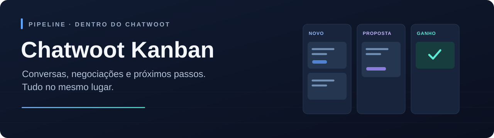
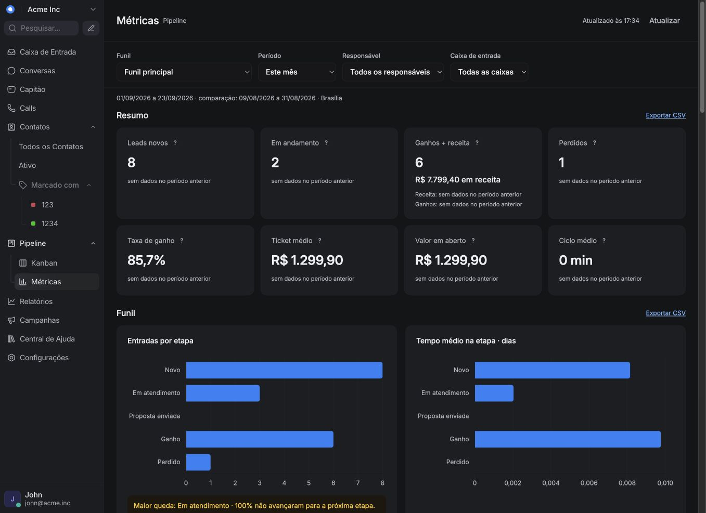
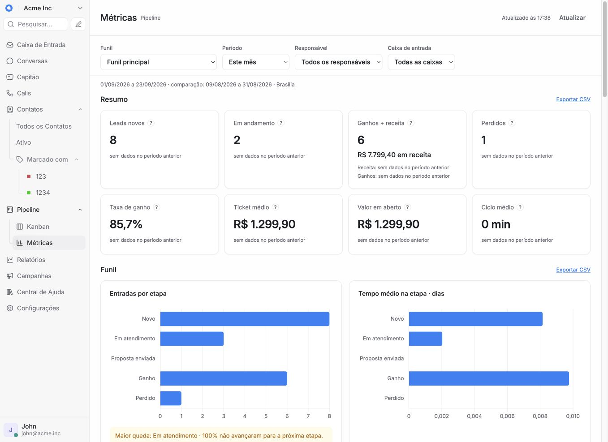
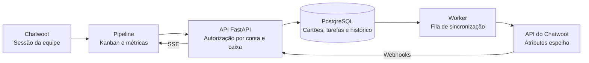

<p align="center">
  
</p>

<p align="center">
  <strong>Transforme o atendimento em um fluxo de trabalho visível.</strong><br>
  Funis, tarefas e métricas dentro do Chatwoot, com a sessão da sua equipe.
</p>

<p align="center">
  <a href="docs/plano-0.2.0.md"></a>
  <a href="docs/fase-1-autorizacao.md"></a>
  
  <a href="LICENSE"></a>
</p>

<p align="center">
  <a href="#o-que-você-pode-fazer">Funcionalidades</a> ·
  <a href="#por-dentro-do-pipeline">Prévia</a> ·
  <a href="#começar-no-ambiente-local">Instalação</a> ·
  <a href="docs/README.md">Documentação</a> ·
  <a href="CONTRIBUTING.md">Contribuir</a>
</p>

---

## O que você pode fazer

Organize negociações em **Pipeline → Kanban** e acompanhe os resultados em
**Pipeline → Métricas**, no menu lateral do Chatwoot. A interface acompanha o tema
claro ou escuro e mantém o contexto da conta selecionada.

| | Recurso | No dia a dia |
| :---: | --- | --- |
| 🗂️ | **Múltiplos funis** | Organize etapas, arraste cartões e acompanhe o valor de cada negociação. |
| ✅ | **Tarefas compartilhadas** | Crie, edite e conclua a tarefa do contato, com vencimento e indicação de atraso. |
| 💬 | **Conversa vinculada** | Siga a conversa de atividade mais recente ou fixe outra no cartão. |
| 📊 | **Métricas e CSV** | Compare períodos e analise ganhos, perdas, origens, equipe e atendimento. |
| 🕓 | **Histórico** | Consulte movimentos e ações, com filtros por contato, funil, etapa e autor. |
| 🔐 | **Acesso por caixa** | Cada agente acessa os cartões permitidos pela sua sessão no Chatwoot. |

Um contato pode participar de vários funis. A tarefa ativa é compartilhada por
contato e conta. Negociações são criadas manualmente; a importação de contatos é
uma ação separada da ativação.

## Por dentro do Pipeline

<p align="center">
  
  <br>
  <sub>Captura do ambiente de desenvolvimento. A apresentação visual não representa certificação de produção.</sub>
</p>

<details>
<summary><strong>☀️ Ver o painel no tema claro</strong></summary>

<p align="center">
  
</p>

</details>

**Ganhos e receita · Conversão · Tempo na etapa · Motivos de perda · Tarefas · Atendimento**

Os relatórios usam datas civis de Brasília e valores em reais. Cada bloco pode ser
exportado em CSV. Consulte o [guia de métricas](docs/metricas.md) para conhecer as
fórmulas, os filtros e os limites de cada indicador.

## Como funciona



O loader registrado em `DASHBOARD_SCRIPTS` incorpora a interface ao Chatwoot,
preservando seu código-fonte. Cartões e tarefas têm autoridade local; o worker
sincroniza os atributos espelho e tenta novamente quando há falhas temporárias.
Alterações concorrentes retornam conflito para evitar sobrescritas silenciosas.

| Camada | Tecnologia |
| --- | --- |
| API e worker | Python 3.12 · FastAPI · httpx |
| Persistência | PostgreSQL 16 · asyncpg · Alembic |
| Interface | HTML · CSS · JavaScript · Chart.js |
| Atualizações | SSE com listener PostgreSQL compartilhado por processo |
| Integração local | Nginx · Rails/Sidekiq do Chatwoot |

## Permissões que acompanham a equipe

- **Administradores:** acesso aos cartões da conta e às configurações administrativas.
- **Agentes:** cartões cuja conversa vinculada pertence a uma caixa permitida.
- **Sem conversa:** cartão visível ao administrador e ao criador, sem canal ou atalho.
- **Contatos e tarefas:** seguem a visibilidade de contatos do Chatwoot Community Edition.
- **Conta desativada:** bloqueia dados, webhooks e novas unidades de trabalho do worker.

As caixas são consultadas com a sessão do agente, com **cache de até 60 segundos**.
Falha ou timeout na consulta nega acesso. Histórico de cartões, métricas, CSV e SSE
respeitam o mesmo escopo. [Detalhes da autorização →](docs/fase-1-autorizacao.md)

## Começar no ambiente local

> **Em desenvolvimento:** a release pública **0.2.0** está em preparação.
> Os contratos foram testados no Chatwoot CE **4.16.2 e 4.18.0**. Instalação de
> produção, carga e fluxo completo de navegador nas duas versões ainda têm etapas
> de certificação pendentes.

Tenha um Chatwoot local preparado, Python 3.12, PostgreSQL 16, Redis, Node.js,
Ruby e as dependências descritas no [guia de instalação](docs/instalacao-local.md).
O ambiente local também utiliza Overmind e Nginx.

```sh
git clone https://github.com/vitorpaimio/chatwoot-kanban.git
cd chatwoot-kanban

python3.12 -m venv .venv
.venv/bin/pip install -r requirements.txt -r requirements-dev.txt
cp .env.example .env
```

Configure `.env` com o banco **exclusivo do Kanban**, as URLs e a chave de
criptografia. O repositório atualmente é privado; o clone exige acesso autorizado.

```sh
# Depois de configurar o ambiente:
.venv/bin/alembic upgrade head
```

Conclua a configuração do loader e do proxy seguindo o
[guia local](docs/instalacao-local.md). Depois:

```sh
scripts/local.sh start
scripts/local.sh status
```

Abra `http://localhost:3000`, entre no Chatwoot e acesse **Pipeline → Kanban**.
Um administrador ativa a conta; a importação de contatos pode ser solicitada
separadamente. Não reutilize o banco do Chatwoot para o Kanban nem execute seeds
sobre uma instalação existente.

## Qualidade e testes

A [Fase 1](docs/fase-1-autorizacao.md) registrou **71 testes Python**, **3 testes Node**
e verificações de frontend no Chrome. Os contratos Rails passaram em **10 grupos
por versão alvo**. Esses números descrevem essa execução, não um status de CI ao vivo.

```sh
# Banco descartável, exclusivo e com nome terminado em _test.
: "${TEST_DATABASE_URL:?Configure o banco exclusivo de testes}"
DATABASE_URL="$TEST_DATABASE_URL" .venv/bin/alembic upgrade head

.venv/bin/ruff check .
.venv/bin/pytest -q
npm ci
node --test tests/test_interface.cjs
node tests/browser/authorization.cjs
```

Os testes Python usam PostgreSQL real e removem dados de teste. O teste
`authorization.cjs` usa Chrome com API controlada. Os roteiros contra Chatwoot
exigem `CHATWOOT_LOGIN_EMAIL` e `CHATWOOT_LOGIN_PASSWORD` no ambiente e mantêm
sessões apenas em memória. [Preparar o ambiente de contribuição →](CONTRIBUTING.md)

## Caminho até a 0.2.0

| Etapa | Situação |
| --- | --- |
| **Fase 0** — contratos e correções imediatas | Concluída, com limites de evidência documentados |
| **Fase 1** — autorização e ativação | Implementada e testada |
| **Fase 2** — recuperação e provisionamento por conta | Planejada |
| **Fase 3** — paginação e certificação de capacidade | Planejada |
| **Fase 4** — instalador Swarm + Traefik | Planejada; Compose + Nginx será o segundo adaptador |
| **Fase 5** — certificação e release pública | Planejada |

O primeiro item após a release será a **criação automática de cartões**, opcional
por funil e caixa de entrada. Não há volumes de uso certificados antes dos testes
de carga. O aplicativo móvel nativo do Chatwoot não exibe o menu Pipeline.

[Ver plano completo →](docs/plano-0.2.0.md)

## Documentação

| Para… | Consulte |
| --- | --- |
| Instalar e remover a integração local | [Instalação local](docs/instalacao-local.md) |
| Atualizar, migrar e recuperar dados | [Backup e recuperação](docs/backup-recuperacao.md) |
| Entender os indicadores | [Guia de métricas](docs/metricas.md) |
| Revisar as provas de autorização | [Evidências da Fase 1](docs/fase-1-autorizacao.md) |
| Entender as decisões técnicas | [ADRs](docs/adr/README.md) |
| Contribuir com o projeto | [CONTRIBUTING](CONTRIBUTING.md) |
| Relatar uma vulnerabilidade | [Política de segurança](SECURITY.md) |

## Licença e créditos

Distribuído sob a [licença MIT](LICENSE), preservando a atribuição aos
**Chatwoot-Kanban contributors** e a origem no projeto
[Chatwoot-Kanban](https://github.com/CrisAlva1414/Chatwoot-Kanban).
O Chart.js acompanha sua [própria licença MIT](app/static/vendor/Chart.LICENSE.md).

---

<p align="center">
  <strong>Do primeiro contato ao próximo passo.</strong><br>
  Feito para equipes que já trabalham no Chatwoot.
</p>
