# Auditoria de UX do Pipeline — 25/09/2026

## Resultado e alcance

Comparação da interface do Pipeline (quadro, ativação e janelas) com o padrão
visual e textual do painel do **Chatwoot CE 4.18.0**. Esta auditoria é a linha
de base: registra o estado atual antes de qualquer alteração visual, para que
cada mudança posterior seja comparada com as mesmas telas.

A base visual já é boa. O quadro não tem paleta própria: `theme.js` copia as
variáveis do Chatwoot para o iframe, e cabeçalho, fonte, raios e cor primária
seguem o painel ([ADR-025](adr/025-design-system-quadro.md)). **As divergências
estão nos componentes e nos fluxos:** janelas, filtros, avisos, estado de
ativação e textos não seguem os componentes do Chatwoot, e o quadro permite
ações antes de a conta estar pronta.

- **Pipeline auditado:** `master` em `c21a271`.
- **Referência:** Chatwoot CE `v4.18.0`, commit
  [`9f920b5`](https://github.com/chatwoot/chatwoot/tree/9f920b549c14491a4e587687a3eed5d21c6ccc7d),
  lido no código-fonte (`app/javascript/dashboard/components-next`, `theme/`,
  `tailwind.config.js`, `i18n/locale/pt_BR`) e conferido no CSS compilado da
  instância local.
- **Ambiente:** Chatwoot 4.18.0 oficial em Docker, conta nova, tema claro, tela
  de computador (~1700 px), navegador Chrome no Windows.
- **Não avaliado nesta rodada:** tema escuro, celular, cartões com dados, janela
  de detalhe da negociação, "Gerenciar funil", Métricas e o item do menu lateral
  (ver [Fora das capturas](#fora-das-capturas)).

**Mudança de premissa:** o ADR-025, `loader.js:270`, `theme.js:10` e
`tests/browser/board-design.cjs` foram validados no Chatwoot **4.16.2**. Esta
auditoria usa a 4.18.0. Adotar a 4.18 como referência deve ser registrado num
ADR novo que atualize os ADRs 024 e 025.

### Prioridades

- **P1:** atrapalha a conclusão de uma tarefa ou leva o usuário a um estado
  inválido.
- **P2:** diverge do padrão do Chatwoot de forma visível, ou o texto confunde.
- **P3:** refinamento visual ou textual sem impacto no fluxo.

Cada achado tem um identificador (`UX-NN`) para ser citado em ADR, sessão,
commit e PR. As linhas citadas em UX-01 a UX-27 referem-se ao commit `c21a271`;
de UX-28 em diante, ao estado da branch `docs/auditoria-ux-pipeline`.

## Padrão de referência do Chatwoot 4.18

Resumo do que o painel usa. Caminhos relativos a
`app/javascript/dashboard/` no repositório do Chatwoot, commit `9f920b5`.

| Tema | Padrão do Chatwoot 4.18 | Fonte |
|---|---|---|
| Fundo | Página `n-surface-1`; menu lateral `n-background`; cartão `n-solid-2` com contorno `n-container`, sem sombra | `routes/dashboard/Dashboard.vue:132-143`, `components-next/CardLayout.vue:21-36` |
| Cabeçalho de página | `px-6`, 80 px (`h-20` ou `py-6` com controles de 32 px), **sem borda inferior**; título à esquerda (`text-xl font-medium` em Contatos; `text-heading-1` 18 px/520 em Campanhas e Configurações); ações à direita | `components-next/Contacts/ContactsHeader/ContactHeader.vue:35-124`, `components-next/Campaigns/CampaignLayout.vue:23-45` |
| Ações do cabeçalho | Busca `h-8` com fundo `n-alpha-2` e ícone `i-lucide-search`; ícones `Button ghost slate sm`; separador `w-px h-4 bg-n-strong`; primário `Button sm` azul **no fim, à direita** | `ContactHeader.vue:44-121` |
| Botão | `rounded-lg`; `sm` = 32 px, `md` = 40 px; azul sólido `bg-n-brand`; neutro `slate` (`bg-n-button-color` com contorno); desabilitado `opacity-50` | `components-next/button/Button.vue:100-200` |
| Campo | `bg-n-alpha-black2`, contorno 1 px `n-weak`, foco `n-brand`; rótulo `text-heading-3` (14 px/500) em `n-slate-12`; ajuda abaixo em `text-label-small` `n-slate-11` | `components-next/input/Input.vue:42-152` |
| Lista de opções | `Select` com `appearance-none` e `i-lucide-chevron-down`; `ComboBox` e `DropdownMenu` próprios (`rounded-xl`, `shadow-lg`, itens de 32 px); filtro do cabeçalho é um ícone com ponto azul quando ativo | `components-next/select/Select.vue:50-100`, `components-next/dropdown-menu/DropdownMenu.vue:139-301` |
| Janela (Dialog) | `max-w-lg` por padrão; `p-6 gap-6`; título `text-base font-medium` (16 px); descrição `text-sm n-slate-11`; rodapé com **Cancelar (faded slate) e Confirmar (azul, ou ruby em exclusão) lado a lado**; **sem botão X**, fecha com Esc ou clique fora | `components-next/dialog/Dialog.vue:117-182` |
| Painel lateral | `SidePanel` com cabeçalho, botão fechar `i-lucide-x` (`aria-label` "Fechar"), corpo com rolagem e rodapé | `components-next/side-panel/SidePanel.vue:92-163` |
| Aviso (Banner) | `rounded-xl`, `text-sm`, `py-2 px-3`; cores slate, amber, teal, ruby e blue (fundo `-3`, borda `-4`, texto `-11`); botão de ação opcional | `components-next/banner/Banner.vue:26-80` |
| Retorno de ação | Toast no topo, centralizado, escuro, 2,5 s ("… com sucesso") | `components/SnackbarContainer.vue:57-72` |
| Estado vazio | Título, subtítulo e ação centralizados sobre cartões fictícios; vazio simples em `text-base n-slate-11` centralizado | `components-next/EmptyStateLayout.vue:24-64` |
| Carregando | `Spinner` centralizado com `py-10 text-n-slate-11` | `routes/dashboard/contacts/pages/ContactsIndex.vue:524-529` |
| Ícones | Lucide via Iconify; 16 px em cabeçalhos e no menu lateral, 14 px em menus | `tailwind.config.js:268-281` |
| Tipografia | Inter variável; tamanhos 12, 14, 16, 18 e 20 px. **13 px não faz parte da escala** | `assets/scss/_woot.scss:88-148` |
| Textos pt-BR | Busca "Pesquisar..."; "Etiquetas"; "Token de acesso"; "Agente"/"Agente atribuído"; "Times"; confirmações "Cancelar"/"Confirmar" | `i18n/locale/pt_BR/components.json:10-21`, `settings.json:101,351-355` |

O Chatwoot 4.18 **não tem tela de quadro ou kanban**. Para colunas e arraste, as
referências mais próximas são `DraggableReorderList` e os cartões `CardLayout`.

## O que já segue o padrão

| Item | Situação |
|---|---|
| Cores | Todas vêm das variáveis do Chatwoot, com tema sincronizado (`theme.js:9-45`). |
| Fonte | Inter herdada do painel (`theme.js:26-29`). |
| Cabeçalho | 80 px e gutter de 24 px, iguais aos de Contatos (`kanban.css:90-99`). |
| Título do funil | 20 px, peso 500, igual ao título de Contatos (`kanban.css:639-645`). |
| Botão primário | Azul `blue-9`, igual a `n-brand` (`kanban.css:59-69`). |
| Busca da barra | Fundo `alpha-2` e ícone de lupa à esquerda, como em Contatos (`kanban.css:138-157`). |
| Raios | 8 px em controles e 12 px em cartões e janelas, como `rounded-lg` e `rounded-xl`. |
| Altura de controles | 32 px, como o tamanho `sm` (`kanban.css:41`). |
| Foco | Contorno visível de 2 px em todos os controles (`kanban.css:51-54`). É mais forte que o do Chatwoot e deve ser mantido por acessibilidade. |

## Análise por tela

### Tela 1 — Ativação (conta sem registro)

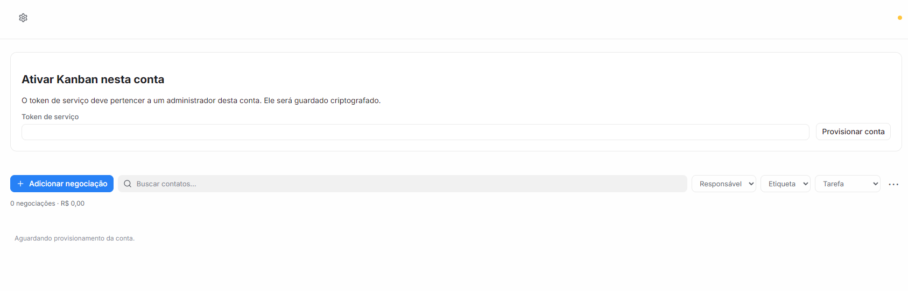

Primeira tela que o administrador vê ao abrir o Pipeline numa conta nova.
Mostra o cartão de ativação e, abaixo dele, o quadro inteiro, vazio.

| Elemento | Chatwoot 4.18 | Pipeline hoje | Achado |
|---|---|---|---|
| Cabeçalho | Título da página à esquerda | Sem título: só a engrenagem, porque não há funil (`kanban.js:1140,1187-1200`) | UX-04 |
| Engrenagem | Ações à direita do cabeçalho | À esquerda, onde ficaria o título (`kanban.html:11-25`) | UX-05 |
| Ponto amarelo | Sem equivalente; status com texto ou badge | Ponto de 8 px sem legenda; o significado só aparece no `title` (`kanban.css:112-124`) | UX-06 |
| Borda do cabeçalho | Sem borda inferior | Borda 1 px `border-weak` (`kanban.css:97`) | UX-22 |
| Título do cartão | 18–20 px, peso 500–520 | `h2` sem regra própria: tamanho e negrito padrão do navegador (~21 px/700) | UX-10 |
| Texto de apoio | Explica onde obter a credencial | Não diz onde encontrar o token | UX-11 |
| Rótulo e botão | "Token de acesso"; ação principal em azul | "Token de serviço"; "Provisionar conta" em botão neutro, sob o título "Ativar" | UX-11, UX-12 |
| Campo | Fundo `alpha-black2`, 40 px em formulário | Fundo branco (`--input` = `solid-1`), 32 px (`kanban.css:10,22-31`) | UX-20 |
| Barra e quadro | Ações só aparecem quando podem ser usadas | "Adicionar negociação", filtros e "0 negociações · R$ 0,00" habilitados sem conta ativa | UX-01 |
| Mensagem do quadro | Estado vazio com título, texto e ação | "Aguardando provisionamento da conta." em 12 px `slate-9`, alinhado à esquerda; a conta nem foi ativada ainda (`kanban.js:925-928`) | UX-02 |
| Busca | "Pesquisar..." | "Buscar contatos…", embora filtre negociações (`kanban.html:58-69`) | UX-14 |
| Filtros | `Select` com seta Lucide, ou ícone de filtro | `<select>` nativo com seta do sistema, 13 px (`kanban.css:131-137`) | UX-08 |
| Mais ações | `ghost slate sm` com `i-lucide-ellipsis-vertical` | Caractere "⋯" de 24 px (`kanban.css:158-172`) | UX-17 |
| Botão primário | No fim do cabeçalho, à direita | No início da barra, à esquerda | UX-18 |

### Tela 2 — "Conta não provisionada"

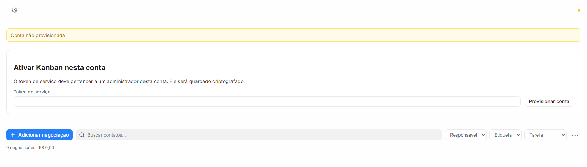

Aparece quando o administrador clica na engrenagem antes de ativar a conta. A
engrenagem chama `accountSettings()`, que pede `/kanban/provisioning`. O
backend responde 404 com o texto "Conta não provisionada"
(`app/routers/provisioning.py:49`), e esse texto cru vai para o aviso
(`kanban.js:1594,1843,1893-1895`).

| Elemento | Chatwoot 4.18 | Pipeline hoje | Achado |
|---|---|---|---|
| Engrenagem | Ações indisponíveis ficam ocultas ou desabilitadas | Visível e clicável, mas só gera erro | UX-03 |
| Texto | Explica o problema e indica o que fazer | Mensagem técnica do servidor, sem instrução, repetindo o cartão logo abaixo | UX-03 |
| Aviso | `Banner` com cor por tipo, `rounded-xl`, `amber-3`/`amber-4`, com ação opcional | `#notice` único em `amber-2`/`amber-5`, raio 8, sem ação; usado também para erro e sucesso (`kanban.css:481-488`, `kanban.js:269-288`) | UX-07 |

### Tela 3 — Janela "Adicionar negociação"

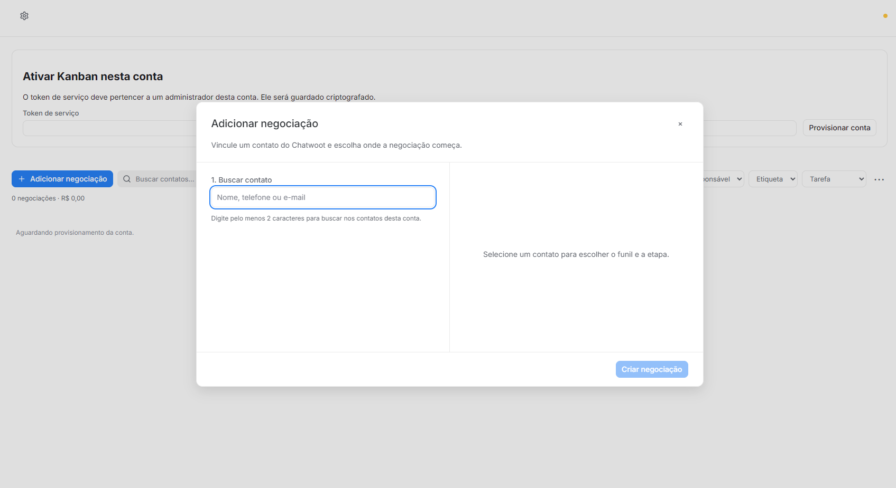

A janela abre mesmo com a conta sem ativação (UX-01). O layout em duas colunas
(buscar contato à esquerda, destino à direita) funciona bem para a tarefa, mas
o acabamento não segue o `Dialog` do Chatwoot.

| Elemento | Chatwoot 4.18 | Pipeline hoje | Achado |
|---|---|---|---|
| Título | 16 px/500 | 20 px/500 (`kanban.css:531-537`) | UX-09 |
| Fechar | Sem X no `Dialog`; no `SidePanel`, `ghost slate sm` com `i-lucide-x` e rótulo "Fechar" | Caractere "×" sem borda nesta janela e com borda na Tela 5 (`kanban.css:786-790`) | UX-09 |
| Rodapé | Cancelar e Confirmar lado a lado | Só o botão principal, alinhado à direita | UX-09 |
| Largura | Até `3xl` (768 px) em formulários longos | 960 px (`kanban.css:778-781`) | UX-23 |
| Passos | — | "1. Buscar contato"; os passos 2 e 3 só aparecem depois da escolha, e o painel direito fica vazio | UX-24 |
| Campo de busca | 40 px, contorno de 1 px `n-brand` no foco | 38 px, contorno de 2 px com afastamento (`kanban.css:819-823`) | UX-20 |
| Fundo escurecido | `n-alpha-black1` com desfoque de 4 px, cobrindo a página inteira | `--overlay` sem desfoque, aplicado só dentro do iframe; o menu lateral do Chatwoot parece não escurecer (a confirmar) | UX-25 |
| Botão desabilitado | `opacity-50`, cursor normal | `opacity .5` com cursor de espera (`kanban.css:47-50`) | UX-21 |

### Tela 4 — Provisionamento em andamento

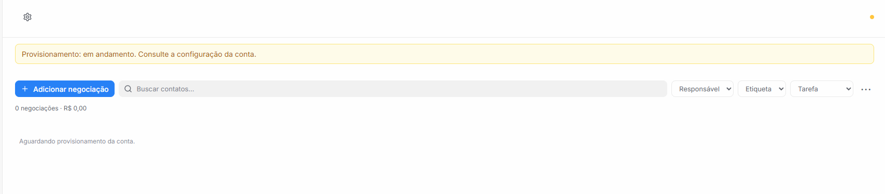

Mostrada depois do envio do token, enquanto o worker cria atributos e webhook.
O quadro consulta o estado a cada 5 s (`kanban.js:1972-1979`).

| Elemento | Chatwoot 4.18 | Pipeline hoje | Achado |
|---|---|---|---|
| Aviso | `Banner` com botão de ação | "Consulte a configuração da conta" sem link nem botão; termo técnico "Provisionamento" | UX-03, UX-13 |
| Progresso | `Spinner` centralizado | Nenhum indicador de progresso; só texto | UX-02 |
| Quadro | Oculto até ter conteúdo | Barra habilitada e mensagem vazia que repete o aviso | UX-01, UX-02 |
| Cabeçalho | Título da página | Continua sem título | UX-04 |

### Tela 5 — Janela "Configuração da conta"

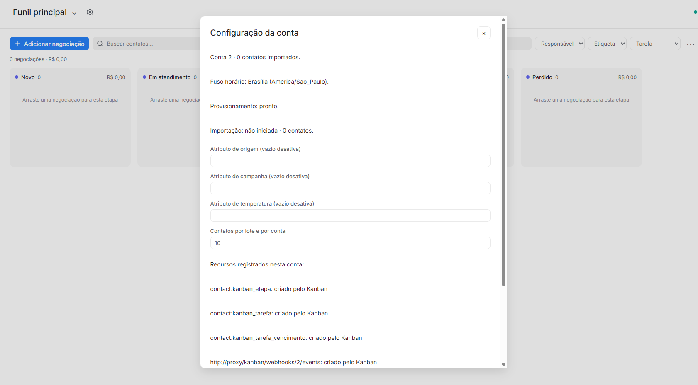

Aberta pela engrenagem depois de a conta ficar pronta. Por trás, aparece o
quadro com as cinco etapas padrão e o ponto verde (tempo real ativo).

| Elemento | Chatwoot 4.18 | Pipeline hoje | Achado |
|---|---|---|---|
| Estrutura | Configurações em seções (`SettingsFieldSection`), ou painel lateral | Parágrafos soltos, campos e botões no mesmo nível; sem agrupamento (`kanban.js:1840-1896`) | UX-15 |
| Espaçamento | `gap-6` entre blocos | ~45 px entre linhas de status: `gap` de 14 px mais a margem padrão de `
`, que o `kanban.css` não zera | UX-15 |
| Status | Badge de status (como em Campanhas) | "Provisionamento: pronto." em texto corrido | UX-15 |
| Dados técnicos | Ocultos, ou em área avançada | "Conta 2", `contact:kanban_etapa` e a URL interna `http://proxy/kanban/webhooks/2/events` expostos (`kanban.js:1869-1870`, `app/services.py:372-399`) | UX-16 |
| Rótulos | Rótulo curto e ajuda abaixo | "(vazio desativa)" dentro do rótulo | UX-16 |
| Fechar | Ver Tela 3 | "×" com borda, diferente da Tela 3 | UX-09 |
| Título do funil | `i-lucide-chevron-down` | Seta "⌄" como caractere (`kanban.js:1134-1186`) | UX-17 |
| Cores das etapas | — | Todas índigo `#6366f1`, inclusive "Ganho" e "Perdido": as etapas padrão são criadas sem cor (`app/services.py:11-17,359`; `app/routers/workspace.py:46`) | UX-19 |
| Colunas | Não há precedente de quadro | 292 px, fundo `background-color`, raio 12; coerente com os tokens | — |

### Tela 6 — Filtro "Tarefa"

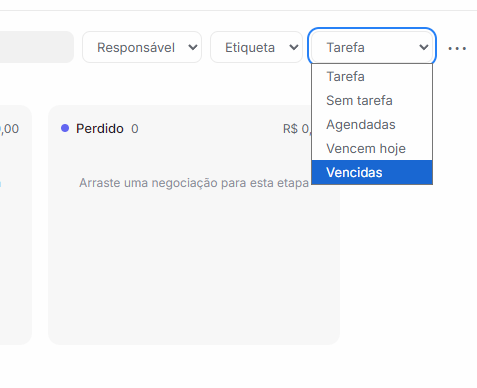

| Elemento | Chatwoot 4.18 | Pipeline hoje | Achado |
|---|---|---|---|
| Lista aberta | `DropdownMenu` ou `ComboBox` com `rounded-xl`, sombra e itens de 32 px | Lista nativa do sistema operacional, com destaque azul do Windows | UX-08 |
| Opção neutra | "Todas", ou rótulo separado do valor | "Tarefa" é ao mesmo tempo o nome do filtro e a opção "todas" | UX-14 |
| Foco | Contorno de 1 px `n-blue-9` | Contorno de 2 px com afastamento | UX-20 |

### Telas da segunda rodada

Capturas do autor depois da primeira entrega, com a conta pronta. A janela
"Configuração da conta" repetiu a Tela 5 e não foi guardada de novo.

| Tela | Captura | Observação | Achado |
|---|---|---|---|
| 11 — Menu Pipeline | 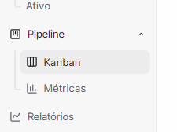 | O clique no grupo só abre e fecha o submenu; é preciso clicar de novo em "Kanban" | UX-26 |
| 8 — Conta desativada | 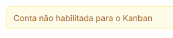 | Mensagem 403 crua do servidor (`app/database.py:62`) depois de desativar a conta | UX-27 |
| 12 — Filtro de etiqueta | 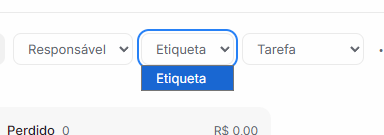 | Conta sem etiquetas: lista nativa com uma única opção, que repete o nome do filtro | UX-08, UX-14 |

### Terceira rodada — quadro com dados e Métricas

Capturas do autor com a conta populada pelos dados demo: 30 contatos, 40
conversas e 25 negociações criadas pelo webhook da etapa. Nas capturas do quadro,
a faixa do menu lateral foi recortada, porque mostrava nome e e-mail.

| Tela | Captura | Observação | Achado |
|---|---|---|---|
| 17 — Adicionar negociação com resultados | 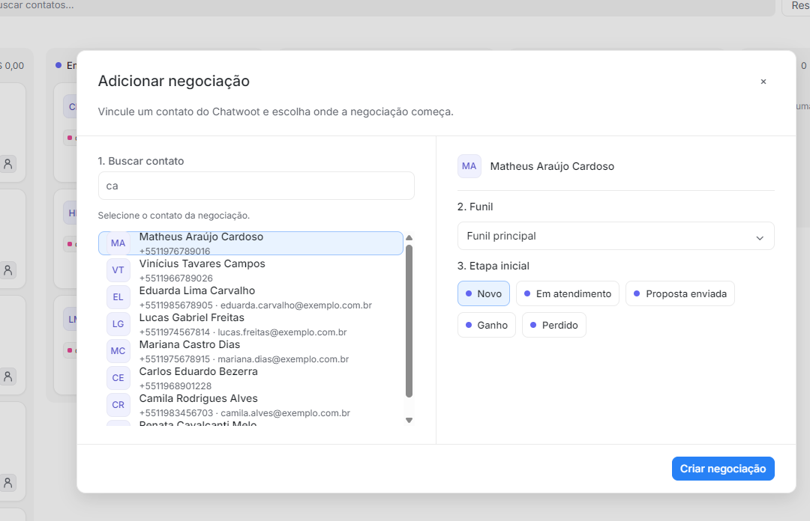 | Linhas coladas, com o contorno da escolha cortando avatar e nome; barra nativa com setas; telefone em E.164 cru | UX-28 |
| 18 — Quadro com dados | 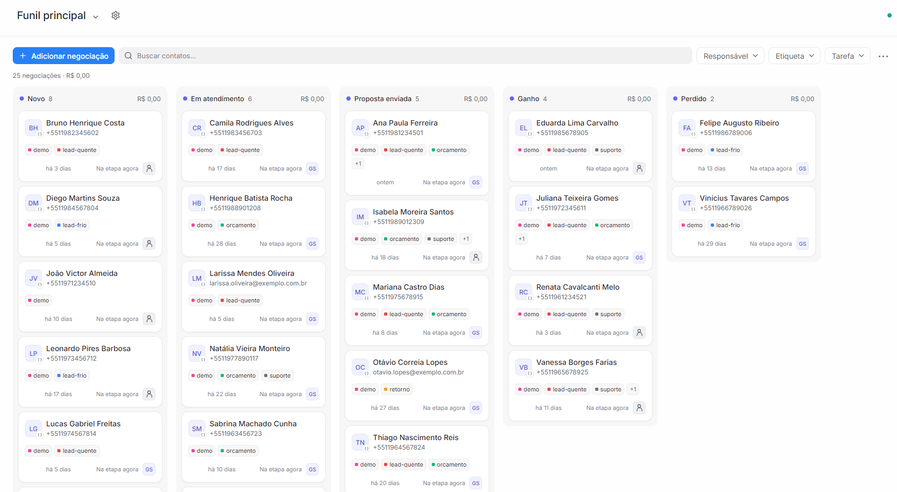 | "Na etapa agora" em todos os cartões; "R$ 0,00" em cada coluna; selo do canal ilegível; responsável ora ícone genérico, ora iniciais | UX-29 a UX-32 |
| 19 — Ações da janela | 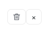 | Excluir (destrutivo) a 8 px de fechar, com o mesmo estilo | UX-33 |
| 20 — Detalhe da negociação | 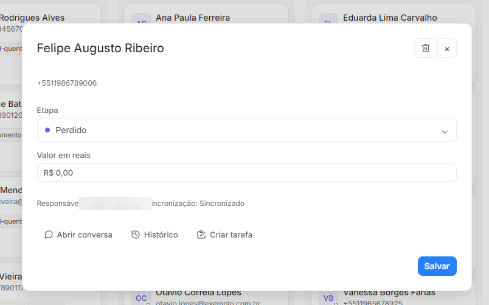 | Telefone solto sem rótulo; linha técnica "Sincronização: Sincronizado"; sem "Cancelar" | UX-34, UX-35 |
| 21 — Cartão em foco | 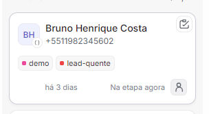 | A ação de tarefa só aparece no hover e não tem rótulo | UX-36 |
| 22 — Rodapé de Gerenciar funil | 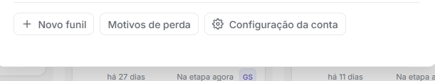 | A configuração da conta fica dentro da gestão do funil | UX-37 |
| 23 — Cabeçalho do quadro | 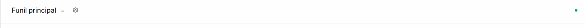 | Repete UX-05, UX-06 e UX-17: seta em caractere, engrenagem colada ao título, ponto sem legenda | UX-38 |

**Métricas.** As capturas da página de Métricas foram analisadas mas não
ficaram gravadas em disco pela interface. Os achados estão descritos em texto,
com a causa no código quando existe:

- **Filtros:** os quatro filtros (Funil, Período, Responsável, Caixa de entrada)
  abrem a lista nativa do sistema (UX-40).
- **Textos colados:** o card "Ganhos + receita" junta dois textos:
  "Receita: → 0% vs. anteriorGanhos: sem dados no período anterior". As duas
  variações são inseridas lado a lado, sem separador (`metricas.js:269-283`)
  (UX-41).
- **Comparação repetida:** "sem dados no período anterior" aparece sob os 8
  indicadores e em cada célula das tabelas (UX-42).
- **0% sem dados:** "Concluídas no prazo" mostra 0% quando nenhuma tarefa foi
  concluída, porque `coalesce(..., 0)` troca "sem dado" por zero
  (`app/metrics/queries.py:65-67`) (UX-43).
- **Controles:** "Exportar CSV" é um link sublinhado em cada bloco; a ordenação
  usa o caractere "↕", e cada coluna tem um "?" com contorno (UX-44, UX-45).
- **Origem:** a seção mostra uma instrução técnica ("Configure os atributos de
  origem e campanha na configuração da conta do Kanban…") e, logo abaixo, duas
  tabelas só com "Não informada" (UX-46).
- **Gráficos:** "Entradas por etapa" repete "Funil principal ·" em cada rótulo
  e usa só azul, ignorando a cor da etapa. "Evolução" traz 25 datas inclinadas
  no eixo e uma curva suavizada que sugere valores entre os dias (UX-47, UX-48).
- **Cabeçalho e textos:**
  - "Pipeline" aparece como contexto miúdo ao lado do título;
  - "Atualizar" é um texto sem ícone;
  - a ajuda diz "card criado no período", em vez de "negociação";
  - a frase "Indicadores de atendimento estão nos relatórios do Chatwoot" fica
    solta entre as seções (UX-49 a UX-51).
- **Rolagem das colunas:** as colunas, recém-roláveis, mostravam a barra nativa
  grossa do Windows, com setas (UX-52).

## Achados consolidados

| ID | P | Achado | Telas | Código | Recomendação |
|---|---|---|---|---|---|
| UX-01 | P1 | Barra, filtros e "Adicionar negociação" ficam habilitados antes da ativação e durante o provisionamento; a janela de negociação abre sem conta pronta | 1, 3, 4 | `kanban.html:52-104`, `kanban.js:1222,1969-1984` | Ocultar barra e quadro até `activation_status = ready`; mostrar só o estado da ativação |
| UX-02 | P2 | Estado vazio fraco e impreciso: "Aguardando provisionamento" aparece antes mesmo da ativação, em 12 px, sem progresso | 1, 4 | `kanban.js:925-928`, `kanban.css:475-480` | Estado vazio no padrão `EmptyStateLayout`: título, texto e ação; `Spinner` durante o provisionamento |
| UX-03 | P2 | A engrenagem gera o erro cru "Conta não provisionada"; o aviso manda "consultar a configuração" sem oferecer o caminho | 2, 4 | `kanban.js:1594,1843,1893-1895`; `provisioning.py:49` | Esconder a engrenagem até a ativação; traduzir o erro; pôr no aviso um botão que abra a configuração |
| UX-04 | P2 | Cabeçalho sem título quando não há funil | 1, 2, 4 | `kanban.js:1140,1187-1200` | Mostrar sempre um título ("Pipeline", ou o nome do funil) |
| UX-05 | P2 | Engrenagem à esquerda, junto do título; no Chatwoot as ações ficam à direita | 1, 2, 4, 5 | `kanban.html:11-25` | Título à esquerda; ações à direita, com separador `n-strong` |
| UX-06 | P2 | Ponto de status sem legenda; fica amarelo ("Reconectando…") em conta não ativada (inferência pelo código, não reproduzida) | 1, 2, 4 | `kanban.css:112-124`, `kanban.js:1930-1964` | Não conectar antes da ativação; dar texto visível ao estado, ou mostrar só erro |
| UX-07 | P2 | Um único aviso âmbar para aviso, erro e sucesso; fora do estilo `Banner` | 2, 4 | `kanban.css:481-488`, `kanban.js:269-288` | Variantes de cor como no `Banner` (ruby, amber, teal); retorno curto de ação como toast |
| UX-08 | P2 | Filtros com `<select>` nativo: seta e lista do sistema operacional | 1, 6 | `kanban.html:70-82`, `kanban.css:131-137` | Menu próprio no estilo `DropdownMenu`, ou pelo menos `appearance:none` com chevron Lucide |
| UX-09 | P2 | Janelas fora do padrão `Dialog`: título de 20 px, "×" em dois estilos, rodapé sem Cancelar | 3, 5 | `kanban.css:512-537,786-790`; `kanban.html:105-116` | Título de 16 px; rodapé Cancelar + Confirmar; fechar com ícone Lucide, rótulo "Fechar" e o mesmo estilo em todas as janelas |
| UX-10 | P2 | Título do cartão de ativação usa o `h2` padrão do navegador (negrito ~21 px) | 1, 2 | `kanban.html:36-51` | Mesma tipografia dos outros títulos (16–18 px, peso 500) |
| UX-11 | P2 | "Token de serviço" em vez de "Token de acesso"; sem instrução de onde obtê-lo | 1, 2 | `kanban.html:36-51` | "Token de acesso" com ajuda: Perfil → Configurações do perfil → Token de acesso |
| UX-12 | P2 | Ação principal "Provisionar conta" em botão neutro, com verbo diferente do título "Ativar" | 1, 2 | `kanban.html:36-51` | Botão azul "Ativar Pipeline" (o mesmo verbo do título) |
| UX-13 | P2 | Jargão técnico na interface: "provisionar", "provisionamento", "Conta N" | 1, 2, 4, 5 | `kanban.js:1836-1870,1972-1979` | "Configurando o Pipeline…", "Pronto"; tratar a conta pelo nome |
| UX-14 | P2 | Textos fora do glossário do Chatwoot: "Buscar contatos…" filtra negociações; "Tarefa" é filtro e opção ao mesmo tempo | 1, 6 | `kanban.html:58-82` | "Pesquisar negociações..."; opção "Todas as tarefas" |
| UX-15 | P2 | "Configuração da conta" sem estrutura: status em parágrafos soltos, espaços de ~45 px, campos e ações misturados | 5 | `kanban.js:1840-1896`, `kanban.css:538-542` | Seções (Status, Atributos, Importação, Avançado) no estilo `SettingsFieldSection`; status como badge; zerar a margem de `
` |
| UX-16 | P2 | Identificadores técnicos e a URL interna do webhook expostos; ajuda dentro do rótulo | 5 | `kanban.js:1844-1870`, `app/services.py:372-399` | Recursos numa seção recolhida "Detalhes técnicos", com nomes legíveis; ajuda como texto abaixo do campo |
| UX-17 | P3 | Caracteres usados como ícones ("⋯", "⌄", "×") | 1, 3, 5 | `kanban.html:83-95`, `kanban.js:1134-1186` | SVG Lucide de 16 px (`ellipsis-vertical`, `chevron-down`, `x`) |
| UX-18 | P3 | Primário no início da barra; no Chatwoot fica no fim do cabeçalho | 1, 4, 5 | `kanban.html:52-57` | Decidir em ADR: cabeçalho (padrão do Chatwoot) ou barra do quadro |
| UX-19 | P3 | Etapas padrão todas em índigo, inclusive "Ganho" e "Perdido" | 5 | `app/services.py:11-17,359` | Cores padrão por tipo: aberta, ganha (teal) e perdida (ruby) |
| UX-20 | P3 | Campos com fundo branco e 13 px, fora da escala; foco com contorno diferente do Chatwoot | 1, 3, 5, 6 | `kanban.css:10,22-31,51-54,131-157` | Fundo `alpha-black2`; 14 px; manter o contorno de 2 px por acessibilidade |
| UX-21 | P3 | O estado desabilitado usa cursor de espera | 3 | `kanban.css:47-50` | Cursor `not-allowed`; espera só durante o envio (`aria-busy`) |
| UX-22 | P3 | Borda inferior no cabeçalho, que o Chatwoot não usa | todas | `kanban.css:97` | Remover, ou manter só com rolagem do quadro |
| UX-23 | P3 | Janela de negociação com 960 px, acima das larguras do `Dialog` | 3 | `kanban.css:778-781` | Até 768 px (`3xl`), ou painel lateral |
| UX-24 | P3 | Passos numerados incompletos ("1." sem "2." visível) e painel direito vazio | 3 | `kanban.js:1237-1255` | Mostrar os três passos desde o início, com os ainda inativos esmaecidos |
| UX-25 | P3 | Fundo escurecido da janela sem desfoque e restrito ao iframe | 3 | `kanban.css:522-524`, `loader.js:113-140` | `alpha-black1` com desfoque; conferir se o menu lateral deve escurecer junto |
| UX-26 | P2 | Clicar em "Pipeline" no menu só abre e fecha o submenu; no Chatwoot, o grupo fechado já navega para o primeiro item (`SidebarGroup.vue:203-216`) | 11 | `loader.js:410-422` | Sem página do Pipeline aberta, o clique abre o Kanban |
| UX-27 | P1 | Conta desativada: a reativação passa pela janela de configuração, e o quadro mostra o erro cru "Conta não habilitada para o Kanban", porque o tempo real continua conectado e recarrega o quadro | 8 | `kanban.js` (`init`, `connect`), `app/database.py:62` | Reativar só com o token; fechar o tempo real fora do estado pronto; tratar 403 voltando ao painel |
| UX-28 | P2 | Lista de contatos de "Adicionar negociação": linhas sem respiro, contorno da escolha cortando o avatar, barra nativa com setas, telefone em E.164 cru | 17 | `kanban.js:1466-1480`, `kanban.css` `.contact-result` | Itens de 40 px como o `DropdownMenu`; escolha só com fundo; barra fina; telefone formatado |
| UX-29 | P2 | "Na etapa agora" / "há X min" em todos os cartões ocupa o rodapé; última atividade e tempo na etapa sem rótulo e com alinhamento irregular | 18 | `kanban.js:850-870` | Mostrar o tempo na etapa só quando passar do limite de "parada"; rótulos por ícone com dica |
| UX-30 | P3 | Selo do canal no avatar com 10 px: o ícone de API do Chatwoot (`i-woot-api`, chaves) vira "()" | 18 | `kanban.js:89-134`, `kanban.css:478-492` | 14 px com fundo, ou só na dica; omitir para canal API |
| UX-31 | P3 | Responsável: ícone genérico de pessoa quando não há ninguém, iniciais quando há; o ícone parece um botão | 18 | `kanban.js:858-870` | Dica "Sem responsável" e contorno tracejado, como no Chatwoot |
| UX-32 | P2 | "R$ 0,00" repetido em cada coluna e no resumo quando nenhuma negociação tem valor | 18 | `kanban.js:740-750,938` | Ocultar o total zerado ou mostrar "—" |
| UX-33 | P2 | Excluir fica ao lado de Fechar, com o mesmo estilo: risco de clique errado | 19, 20 | `kanban.js:700-720` | Excluir no menu "⋯" ou no rodapé, em ruby, com confirmação `type="alert"` |
| UX-34 | P2 | Detalhe: telefone solto sem rótulo nem ação; "Sincronização: Sincronizado" é informação técnica | 20 | `kanban.js:648-680` | Contato com ícone e link para o contato; sincronização só quando falhar |
| UX-35 | P3 | Detalhe sem "Cancelar", com espaço vazio grande antes do rodapé | 20 | `kanban.js:648-720` | Rodapé Cancelar + Salvar (UX-09); espaçamento `gap-6` |
| UX-36 | P3 | A ação de tarefa do cartão só aparece no hover e só tem ícone | 21 | `kanban.css:605-620` | Mostrar também no foco pelo teclado e com rótulo na dica |
| UX-37 | P2 | "Configuração da conta" fica dentro de "Gerenciar funil" | 22 | `kanban.js:1824` | Mudar para a página Configurações do Pipeline |
| UX-38 | P3 | Cabeçalho do quadro repete UX-05, UX-06 e UX-17 | 23 | `kanban.html:10-34` | Tratar junto com esses achados |
| UX-39 | P1 | Rolar sobre o quadro movia a página inteira (cabeçalho e filtros), porque a página era ~27 px mais alta que a janela | 18 | `kanban.css` `#board` (`min-height: calc(100vh - 172px)`) | Página de altura fixa; quadro rola na horizontal e cada coluna na vertical |
| UX-40 | P2 | Filtros de Métricas com `<select>` nativo | Métricas | `metricas.html:21-52` | Reusar `filterMenu` (ADR-044) |
| UX-41 | P2 | Texto colado "anteriorGanhos:" no card Ganhos + receita | Métricas | `metricas.js:269-283` | Uma linha por variação, com rótulo |
| UX-42 | P2 | "sem dados no período anterior" repetido sob cada número | Métricas | `metricas.js:108-114` | Omitir a comparação sem dado; uma nota única no topo |
| UX-43 | P2 | "Concluídas no prazo" mostra 0% sem nenhuma tarefa concluída | Métricas | `app/metrics/queries.py:65-67` | Devolver nulo e mostrar "—" |
| UX-44 | P3 | "Exportar CSV" como link sublinhado em cada bloco | Métricas | `metricas.js` | `Button` link ou ghost com `i-lucide-download` |
| UX-45 | P3 | Ordenação com o caractere "↕" e "?" com contorno em cada coluna | Métricas | `metricas.js:92-98` | Ícone só na coluna ordenada; ajuda na dica do cabeçalho |
| UX-46 | P2 | Origem/campanha sem configuração: instrução técnica mais tabelas com só "Não informada" | Métricas | `metricas.js` (bloco sources) | Estado vazio único, com ação para Configurações (administrador) |
| UX-47 | P3 | "Entradas por etapa" repete o nome do funil e ignora a cor da etapa | Métricas | `metricas.js` (bloco funnel) | Nome do funil só com vários funis; cor da etapa nas barras |
| UX-48 | P3 | "Evolução": curva suavizada e 25 datas inclinadas no eixo | Métricas | `metricas.js` (bloco timeline) | Linhas retas; rótulos espaçados |
| UX-49 | P3 | Cabeçalho de Métricas: contexto "Pipeline" miúdo e "Atualizar" sem ícone | Métricas | `metricas.html:15-20` | Título só; `ghost slate sm` com `i-lucide-refresh-cw` |
| UX-50 | P3 | A ajuda diz "card" em vez de "negociação" | Métricas | `metricas.js:13-44` | Glossário do Pipeline |
| UX-51 | P3 | Frase solta "Indicadores de atendimento estão nos relatórios do Chatwoot" | Métricas | `metricas.html:55-72` | Nota no rodapé ou link para Relatórios |
| UX-52 | P2 | Colunas roláveis com a barra nativa grossa do Windows (regressão do UX-39) | quadro | `kanban.css` `.column` | `scrollbar-width: thin` com cor `slate-6` |
| UX-53 | P2 | Com valor e tarefa, a linha de baixo do cartão (valor, última atividade, tempo na etapa e avatar) ficou mais larga que a coluna: barra horizontal em cada coluna e avatar cortado; o texto da tarefa ficava com poucas letras | quadro com dados | `kanban.js` (rodapé e tarefa do cartão), `kanban.css` `.column` | Uma marcação de tempo; tempo na etapa na dica; responsável da tarefa como avatar; coluna sem rolagem horizontal |
| UX-54 | P2 | A tarefa ocupava o cartão (texto, data e avatar do responsável), repetindo o avatar do responsável da negociação; o texto ficava truncado e os dados da tarefa não apareciam ao abrir a negociação | quadro com dados | `kanban.js` (cartão e `details`) | Cartão só com um indicador de tarefa (cor pelo vencimento, detalhe na dica); texto, vencimento e responsável da tarefa na janela da negociação |

## Situação dos achados

Atualizada a cada entrega. Achados não listados continuam pendentes.

| ID | Situação | Entrega |
|---|---|---|
| UX-01 | Atendido: barra, resumo e quadro ficam ocultos até a conta estar pronta | [ADR-043](adr/043-ativacao-e-referencia-chatwoot-418.md) |
| UX-02 | Parcial: cada estado da ativação tem título, texto e progresso; com a conta pronta e sem funil ativo, o quadro ainda mostra um texto simples | ADR-043 |
| UX-03 | Atendido: a engrenagem só aparece com a conta pronta; o painel oferece "Abrir configurações" e "Tentar novamente" | ADR-043 |
| UX-04 | Atendido: o cabeçalho mostra "Pipeline" enquanto não há funil | ADR-043 |
| UX-06 | Parcial: o ponto e o tempo real só aparecem depois da ativação; o ponto continua sem legenda visível | ADR-043 |
| UX-10 | Atendido: título do painel em 18 px, peso 520 | ADR-043 |
| UX-11 | Atendido: "Token de acesso", com o caminho no Chatwoot | ADR-043 |
| UX-12 | Atendido: botão azul "Ativar Pipeline" | ADR-043 |
| UX-13 | Parcial: o fluxo de ativação não usa mais "provisionar"; "Configuração da conta" mantém os termos até o UX-15 | ADR-043 |
| UX-08 | Parcial: Responsável, Etiqueta e Tarefa usam menu no padrão `DropdownMenu`, com pesquisa, cor da etiqueta e estado vazio; os `<select>` das janelas e de Métricas continuam nativos | [ADR-044](adr/044-menu-e-filtros-chatwoot-418.md) |
| UX-14 | Parcial: opções neutras "Todos os responsáveis", "Todas as etiquetas" e "Todas as tarefas"; a busca ainda diz "Buscar contatos…" | ADR-044 |
| UX-26 | Atendido: sem página aberta, o clique no grupo abre o Kanban; com página aberta, recolhe | ADR-044 |
| UX-27 | Atendido: conta desativada mostra o formulário "Reativar Pipeline"; tempo real fechado fora do estado pronto; 403 volta ao painel | ADR-043 |
| UX-39 | Atendido: cabeçalho, barra e resumo fixos; quadro rola na horizontal e cada coluna na vertical, com a etapa sempre visível | [ADR-045](adr/045-paginas-tarefas-configuracoes.md) |
| UX-52 | Atendido: barra de rolagem fina (`scrollbar-width: thin`) no quadro e nas colunas | ADR-045 |
| UX-37 | Atendido: a configuração da conta (situação, atributos, motivos de perda, importação, token, desativação e detalhes técnicos) fica na página Configurações; a janela "Gerenciar funil" virou só a lista de etapas | ADR-045 |
| UX-05 | Atendido: título e ponto de status à esquerda; "Etapas", "⋯" (Editar e Arquivar funil) e "Novo funil" à direita, com separador | ADR-045 |
| UX-15 | Atendido: Configurações em cartões por assunto, com status em selo e ações em cada cartão | ADR-045 |
| UX-16 | Atendido: recursos técnicos numa seção recolhida, com nomes legíveis; ajuda como texto do cartão | ADR-045 |
| UX-13 | Atendido: sem "provisionar/provisionamento" na interface; a situação usa "Pronto", "Configurando…" e "Precisa de atenção" | ADR-045 |
| UX-17 | Parcial: "⋯" da barra e do funil viram ícones SVG; a seta "⌄" do funil e o "×" das janelas continuam caracteres | ADR-045 |
| UX-53 | Atendido: uma marcação de tempo no cartão, tempo na etapa na dica, responsável da tarefa como avatar e coluna sem rolagem horizontal | ADR-045 |
| UX-08 | Parcial: filtros do quadro e de Métricas usam o menu compartilhado; os `<select>` das janelas (tarefa, histórico, motivo da perda) continuam nativos | [ADR-046](adr/046-metricas-padrao-chatwoot-418.md) |
| UX-54 | Atendido: cartão só com o indicador de tarefa; texto, vencimento e responsável da tarefa na janela da negociação | ADR-045 |
| UX-18 | Atendido: barra no padrão das listas do Chatwoot, com busca de 240 px à esquerda, filtros e "⋯" à direita, separador e "Adicionar negociação" no fim | ADR-045 |
| UX-14 | Atendido: busca "Pesquisar..." (rótulo "Pesquisar negociações") e opções neutras "Todos/Todas" nos filtros | ADR-045 |
| UX-06 | Parcial: o ponto de status abre Configurações para administradores, com o estado na dica; continua sem legenda visível | ADR-045 |
| UX-34 | Parcial: a sincronização só aparece na janela quando não está em dia; o telefone continua sem ação | ADR-045 |
| UX-40 a UX-51 | Atendidos: filtros por menu, variações com rótulo, nota única sem período anterior, "—" sem base, exportar com ícone, ordenação só na coluna ativa, estado vazio de origem com ação, cor da etapa nas barras, gráfico reto, cabeçalho só com título, "negociação" na ajuda e nota de atendimento no rodapé | ADR-046 |

### Depois — fluxo de ativação

Capturas com o CSS real do Chatwoot 4.18 local e a API do Kanban controlada,
no mesmo enquadramento. A variante escura tem o sufixo `-escuro`.

| Estado | Claro | Escuro |
|---|---|---|
| Ativação (administrador) | [01](evidencias/auditoria-ux/depois/01-ativacao-inicial.png) | [01](evidencias/auditoria-ux/depois/01-ativacao-inicial-escuro.png) |
| Token recusado (substitui "Conta não provisionada") | [02](evidencias/auditoria-ux/depois/02-token-recusado.png) | [02](evidencias/auditoria-ux/depois/02-token-recusado-escuro.png) |
| Configurando | [04](evidencias/auditoria-ux/depois/04-configurando.png) | [04](evidencias/auditoria-ux/depois/04-configurando-escuro.png) |
| Falha com nova tentativa | [07](evidencias/auditoria-ux/depois/07-falha-com-nova-tentativa.png) | [07](evidencias/auditoria-ux/depois/07-falha-com-nova-tentativa-escuro.png) |
| Conta desativada: reativar com o token | [08](evidencias/auditoria-ux/depois/08-conta-desativada.png) | [08](evidencias/auditoria-ux/depois/08-conta-desativada-escuro.png) |
| Filtro de etiqueta sem etiquetas | [12](evidencias/auditoria-ux/depois/12-filtro-etiqueta.png) | [12](evidencias/auditoria-ux/depois/12-filtro-etiqueta-escuro.png) |
| Filtro de etiqueta com pesquisa e cores | [13](evidencias/auditoria-ux/depois/13-filtro-etiqueta-com-pesquisa.png) | [13](evidencias/auditoria-ux/depois/13-filtro-etiqueta-com-pesquisa-escuro.png) |
| Página Tarefas (nova) | [14](evidencias/auditoria-ux/depois/14-tarefas.png) | [14](evidencias/auditoria-ux/depois/14-tarefas-escuro.png) |
| Página Configurações com notas de versão (nova) | [15](evidencias/auditoria-ux/depois/15-configuracoes.png) | [15](evidencias/auditoria-ux/depois/15-configuracoes-escuro.png) |
| Quadro com colunas roláveis e cabeçalho fixo | [16](evidencias/auditoria-ux/depois/16-quadro-colunas.png) | [16](evidencias/auditoria-ux/depois/16-quadro-colunas-escuro.png) |
| Agente sem ativação | [09](evidencias/auditoria-ux/depois/09-agente-sem-ativacao.png) | [09](evidencias/auditoria-ux/depois/09-agente-sem-ativacao-escuro.png) |
| Conflito de atributo (`failed`) | [10](evidencias/auditoria-ux/depois/10-conflito-de-atributo.png) | [10](evidencias/auditoria-ux/depois/10-conflito-de-atributo-escuro.png) |

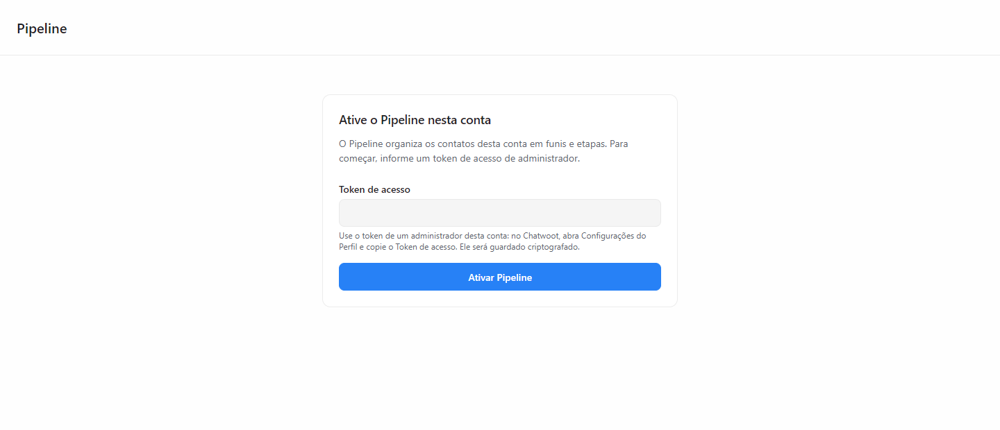

### Depois — Configurações, barra do funil, cartões e Métricas

| Tela | Claro | Escuro |
|---|---|---|
| Configurações da conta | [15](evidencias/auditoria-ux/depois/15-configuracoes.png) | [15](evidencias/auditoria-ux/depois/15-configuracoes-escuro.png) |
| Quadro com a barra do funil | [16](evidencias/auditoria-ux/depois/16-quadro-colunas.png) | [16](evidencias/auditoria-ux/depois/16-quadro-colunas-escuro.png) |
| Janela "Etapas" | [25](evidencias/auditoria-ux/depois/25-etapas-do-funil.png) | [25](evidencias/auditoria-ux/depois/25-etapas-do-funil-escuro.png) |
| Menu "⋯" do funil | [26](evidencias/auditoria-ux/depois/26-menu-do-funil.png) | [26](evidencias/auditoria-ux/depois/26-menu-do-funil-escuro.png) |
| Cartões com valor e indicador de tarefa | [27](evidencias/auditoria-ux/depois/27-cartoes.png) | [27](evidencias/auditoria-ux/depois/27-cartoes-escuro.png) |
| Barra do quadro (busca de 240 px) | [28](evidencias/auditoria-ux/depois/28-barra.png) | [28](evidencias/auditoria-ux/depois/28-barra-escuro.png) |
| Métricas (página inteira) | [24](evidencias/auditoria-ux/depois/24-metricas.png) | [24](evidencias/auditoria-ux/depois/24-metricas-escuro.png) |

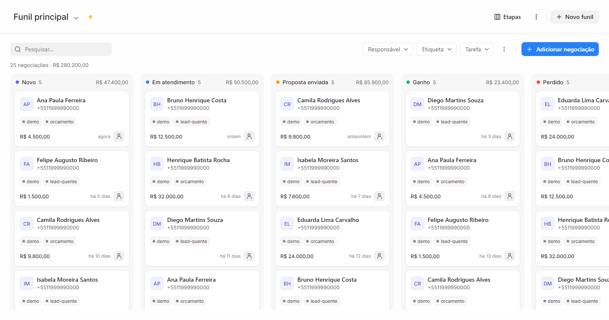

## Glossário de textos

| Texto atual | Onde | Termo do Chatwoot pt-BR | Sugestão |
|---|---|---|---|
| Buscar contatos… | Barra | "Pesquisar..." | Pesquisar negociações... |
| Token de serviço | Ativação, configuração | "Token de acesso" (`settings.json:101`) | Token de acesso |
| Provisionar conta | Ativação | — | Ativar Pipeline |
| Conta não provisionada | Aviso | — | O Pipeline ainda não foi ativado nesta conta. |
| Provisionamento: em andamento | Aviso, configuração | — | Configurando o Pipeline… |
| Aguardando provisionamento da conta. | Quadro | — | (estado vazio com título e texto) |
| Configuração da conta | Janela | "Configurações" | Configurações do Pipeline |
| Responsável | Filtro, tarefa | "Agente atribuído" | Manter "Responsável" (termo usual de CRM), registrando a escolha |
| Etiqueta | Filtro | "Etiquetas" | Mantido |
| Tarefa (opção neutra) | Filtro | "Todas" | Todas as tarefas |
| (vazio desativa) | Configuração | ajuda abaixo do campo | "Deixe vazio para não usar." como ajuda |

## Fora das capturas

Precisam de capturas próprias antes de alterar:

- Tema escuro de todas as telas. No escuro, `n-container` fica transparente e
  os cartões nativos perdem o contorno; o quadro usa `border-weak`.
- Quadro com negociações: cartão, etiquetas, tarefa, arraste e paginação.
- Janelas de detalhe, tarefa, histórico, motivo da perda, "Gerenciar funil",
  funil e etapa.
- Página de Métricas.
- Item "Pipeline" no menu lateral, expandido e recolhido.
- Telas estreitas (≤ 900 px e celular).
- Usuário não administrador ("Peça a um administrador…").

## Testes afetados por mudanças visuais

Qualquer alteração deve rodar e, se preciso, atualizar:

- `tests/browser/board-design.cjs`: coluna de 292 px, cabeçalho com a altura do
  nativo, título do tamanho de `.text-xl`, `#connection` sem texto, cores de
  `.label-dot` e das datas de tarefa.
- `tests/browser/sidebar.cjs`: três SVG no menu e métricas iguais às do item
  nativo.
- `tests/browser/phase2.cjs` e `live.cjs`: textos exatos, como
  "Provisionamento: pronto.", "contact:kanban_etapa: preexistente",
  "Gerenciar funis", "Adicionar negociação" e "1. Buscar contato".
- `tests/browser/phase3.cjs:144`: usa `selectOption` no campo de etapa, que
  desde o commit `8976293` é um menu próprio. Provavelmente já está quebrado.

## Limitações

- As capturas foram feitas pelo autor e recortadas. Nas telas 3 e 5, a faixa
  do menu lateral do Chatwoot foi removida para não publicar dados da conta.
  O corte visível nos originais vem do recorte, não da interface:
  `loader.js:104` alinha o painel à borda direita do menu lateral.
- O ciclo amarelo do ponto de status em conta não ativada (UX-06) foi deduzido
  do código e não reproduzido.
- A escala e os componentes de referência vêm do código-fonte da 4.18.0. Não
  houve comparação lado a lado com telas nativas autenticadas.
- As capturas da página de Métricas (terceira rodada) não foram gravadas em
  disco; os achados UX-40 a UX-51 estão descritos em texto e precisam de
  capturas próprias quando forem tratados.
- As capturas "depois" usam o CSS real do Chatwoot 4.18 local com a API do
  Kanban simulada. O navegador sem interface usa barras de rolagem
  sobrepostas, por isso a barra fina (UX-52) não aparece nas imagens.

## Evidências

- Capturas desta linha de base: `docs/evidencias/auditoria-ux/antes/`.
- Depois de cada alteração, gravar a mesma tela em
  `docs/evidencias/auditoria-ux/depois/`, com o mesmo nome de arquivo, e citar
  os IDs `UX-NN` atendidos.
